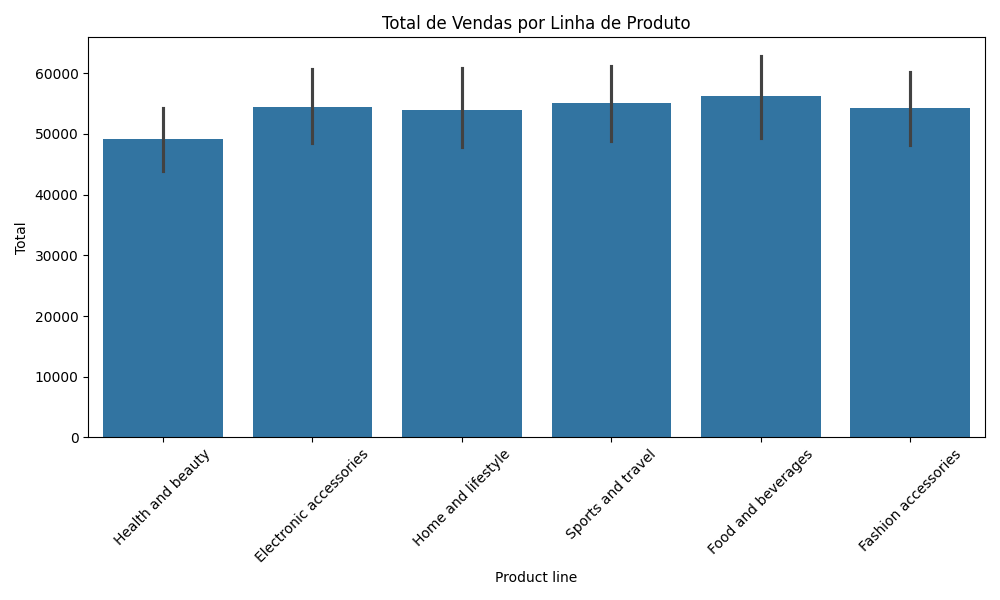
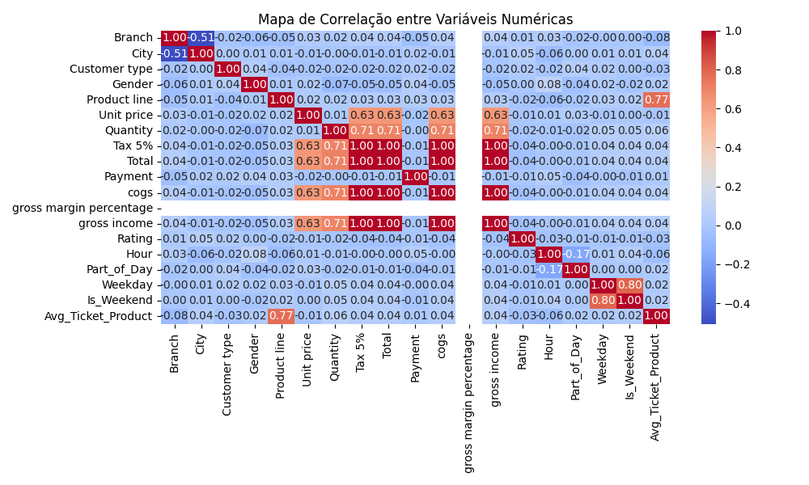

# 🛒 Supermarket Sales Forecast com Machine Learning

Este projeto tem como objetivo prever o **valor total de vendas em um supermercado** com base em variáveis como tipo de produto, horário da compra, gênero do cliente, entre outros. A ideia é simular um cenário real de previsão de demanda que **pode ser aplicado em centros de distribuição, planejamento de estoque e transporte**, elementos-chave da cadeia de suprimentos.

## 🎯 Aplicação na Logística

Embora os dados venham de vendas no varejo, as técnicas utilizadas podem ser facilmente aplicadas para:

- 📦 Prever volumes de pedidos em centros de distribuição
- 🛒 Apoiar decisões de compras e reposição de estoque
- 🚚 Melhorar a eficiência logística e alocação de recursos
- 📉 Reduzir rupturas ou excesso de estoque

Este projeto mostra como modelos preditivos ajudam a antecipar a demanda e melhorar a performance da cadeia logística.

## 📁 Estrutura do Projeto

```
previsao-demanda-supermercado-logistica/
├── data/
│   └── Dados.csv
├── images/
│   ├── heatmap_correlacao.png
│   └── total_vendas_produto.png
├── src/
│   └── supermercado_previsao_vendas_rf.ipynb
├── README.md
└── requirements.txt
```

## 🔍 Problema

Prever a coluna `Total` de uma venda no supermercado com base em variáveis relacionadas ao produto, cliente, localização, data e hora.

## 📦 Fonte dos Dados

Os dados simulam um cenário de vendas no varejo, com as seguintes colunas principais:

- `Invoice ID`, `Branch`, `City`, `Customer Type`, `Gender`
- `Product line`, `Unit Price`, `Quantity`, `Tax 5%`, `Total`
- `Date`, `Time`, `Payment`, `Rating`

## ⚙️ Tecnologias Utilizadas

- 🐍 Python 3.10+
- 📊 Pandas, Numpy, Seaborn, Matplotlib
- 🤖 Scikit-Learn

## 🚀 Etapas do Projeto

1. **Importação e análise dos dados**
2. **Pré-processamento:**
   - Conversão de datas e extração de hora
   - Criação de variáveis como `Part_of_Day` e `Is_Weekend`
3. **Feature Engineering:**
   - Ticket médio por linha de produto
   - Label Encoding para variáveis categóricas
4. **Divisão dos dados em treino e teste**
5. **Treinamento do modelo `Random Forest Regressor`**
6. **Avaliação do modelo com MSE e R²**
7. **Visualização das features mais importantes**
8. **Geração de gráficos salvos em `/images`**

## 📈 Resultados

- **MSE (Erro Quadrático Médio):** 102.3436  
- **R² (Coeficiente de Determinação):** 0.9984  

### 🔍 Features mais importantes:

- `Quantity`
- `Unit Price`
- `Rating`

## 📊 Gráficos Gerados

### Total de vendas por linha de produto


### Correlação entre variáveis numéricas


> 🧠 **Nota:** Como a variável `Total` é diretamente influenciada por `Quantity` e `Unit Price`, o modelo atinge um R² muito alto. Em cenários reais, o desafio costuma ser prever a `Quantity` futura com base em dados históricos.

## ▶️ Como usar

1. Clone o repositório  
2. Instale as dependências com:  
   ```bash
   pip install -r requirements.txt
   ```
3. Abra o notebook:  
   ```bash
   jupyter notebook src/supermercado_previsao_vendas_rf.ipynb
   ```

## 👨‍💻 Autor

**Leonardo Coelho**  
Analista de Transportes | Estudante de Ciência de Dados  
📧 lnrds.coelho@gmail.com  
🔗 [GitHub](https://github.com/LeonardCoelho) | [LinkedIn](https://linkedin.com/in/leonardcoelho)

---

## ✅ Conclusão

Projeto que demonstra domínio prático de Machine Learning com aplicação direta em **previsão de demanda**, essencial para **logística, compras e supply chain**.
